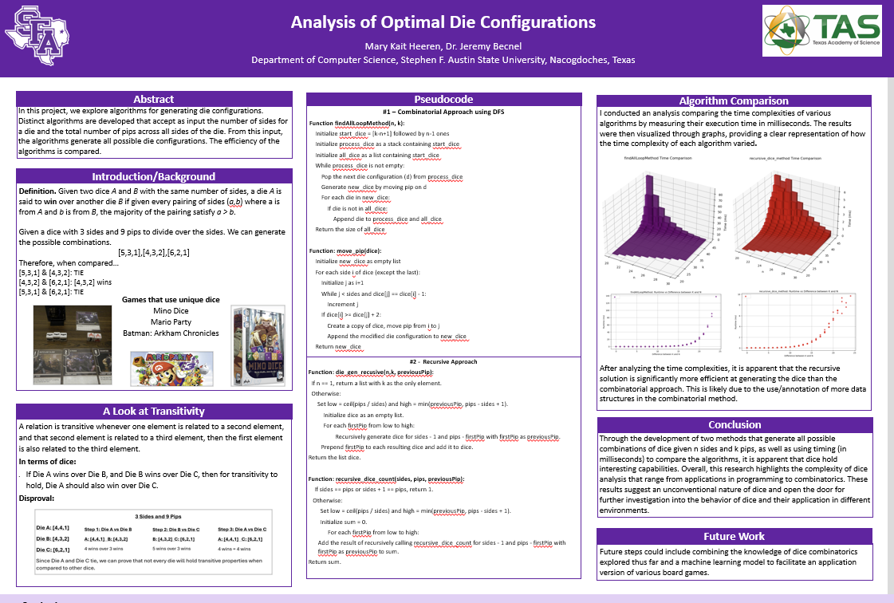

# DiceProblem

This project models dice of various sizes and configurations and uses simulations to determine which perform better under multiple scenarios.

Surprising results are discovered including the non-transivity of "best" die configurations. Several algorithms are studied for efficiency analysis in the die construction.

)

